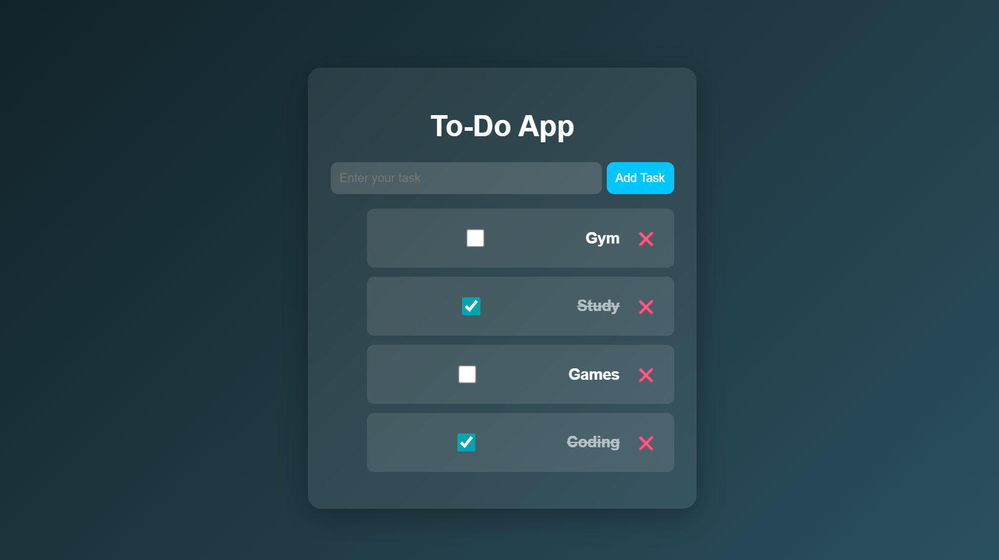

# 📝 To-Do List Web App

A clean and interactive To-Do List application built using **HTML, CSS, and JavaScript**.  
This app helps users manage daily tasks efficiently with persistent storage using browser localStorage.

---

## 🚀 Live Demo
👉 https://dadapeer-source.github.io/HexSoftawares_To-do-App/

---

## 📸 Preview
)
=======

---

## ✨ Features

- ➕ Add new tasks  
- ❌ Delete tasks  
- ✔️ Mark tasks as completed  
- 💾 Save tasks using localStorage  
- 🔄 Data persists after page refresh  
- ⌨️ Add tasks using Enter key  
- 🎨 Modern UI with glassmorphism design  

---

## 🛠️ Tech Stack

- HTML5  
- CSS3 (Flexbox + Modern UI Design)  
- JavaScript (DOM Manipulation & localStorage)  

---

## 📂 Project Structure
To-do-App/
│
├── index.html
├── style.css
└── script.js

---

## ⚙️ How It Works

1. User enters a task  
2. Task is dynamically added to the DOM  
3. Each task includes:
   - Checkbox (mark complete)
   - Delete button  
4. Tasks are stored in **localStorage**  
5. On page reload, tasks are automatically restored  

---

## 📌 Learning Outcomes

- DOM manipulation using JavaScript  
- Event handling (click, change, keypress)  
- Working with localStorage  
- Dynamic UI updates  
- Structuring frontend projects  

---

## 📈 Future Improvements

- Edit task feature  
- Task filtering (Completed / Pending)  
- Drag & drop tasks  
- Backend integration  

---

## 👨‍💻 Author

**Dadapeer**  
GitHub: https://github.com/Dadapeer-source  

---

## 📜 License

This project is open-source and free to use.
